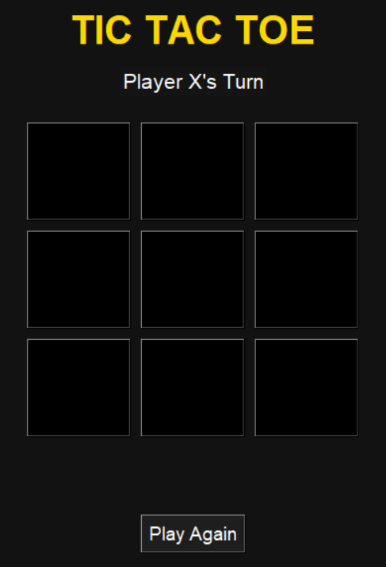
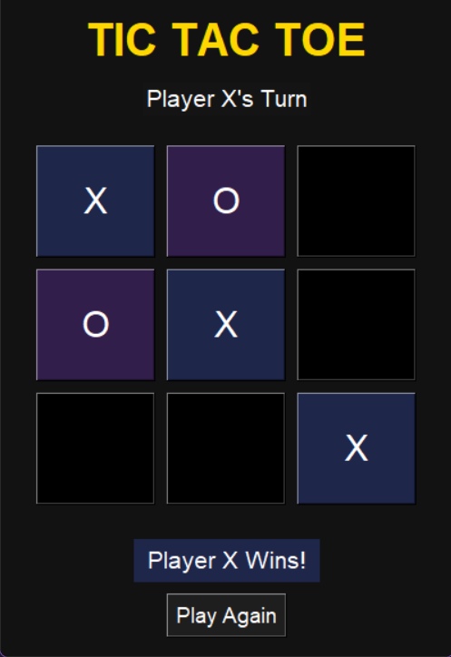
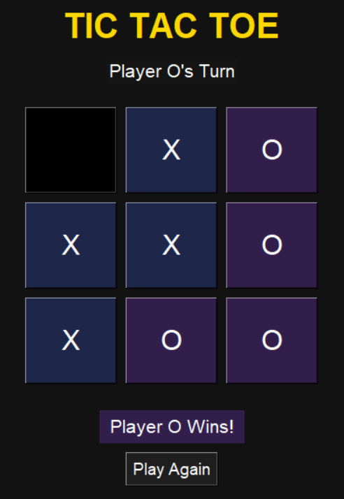
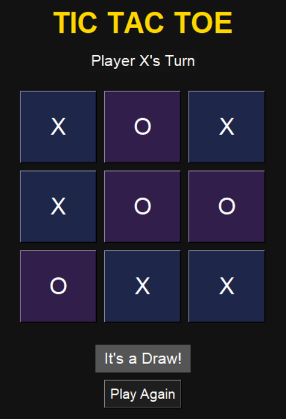

# Tic Tac Toe Game

A simple Tic Tac Toe game built as a learning project to practice programming logic and basic game development concepts.

## Features
- Two-player gameplay
- Turn-based logic
- Win and draw detection
- Simple and interactive interface

## Tech Stack
- Programming Language: Python
- Framework / Library: Tkinter GUI

## Getting Started

### Run the Game
1. Clone the repository:
   ```bash
   git clone https://github.com/your-username/tic-tac-toe.git

## Screenshot







## Purpose
This project was created to practice game logic, conditional statements, and basic user interaction.  
It is intended for learning purposes and future reference.

## License
This project is open for learning and personal use.
